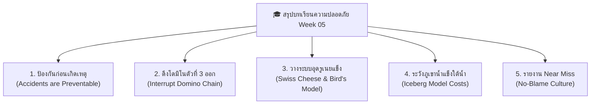

# Week 05: พื้นฐานการป้องกันอุบัติเหตุ (Basics of Accident Prevention)

---

## 📝 สรุปเนื้อหาประจำสัปดาห์ (Week 05 Summary)

> 💡 **บทสรุปภาพรวม (Executive Summary):**  
> สัปดาห์นี้เราได้เรียนรู้ว่า **"อุบัติเหตุไม่ใช่เรื่องของโชคชะตาหรือดวงชะตา"** แต่คือเหตุการณ์ที่มีสาเหตุรากเหง้าซ่อนอยู่เสมอ หากเรารู้วิธีวิเคราะห์ผ่านทฤษฎีโดมิโน โมเดลเนยแข็งสวิส และทฤษฎีภูเขาน้ำแข็ง เราจะสามารถตัดปฏิกิริยาลูกโซ่อุบัติเหตุและอุดรูรั่วเชิงระบบได้อย่างมีประสิทธิภาพ

---

### 🌐 5 ประเด็นสรุปสำคัญ คำคมและสุภาษิตนานาชาติ (Global Safety Proverbs)

---

#### 1️⃣ อุบัติเหตุไม่ได้เกิดจากโชคชะตา แต่ป้องกันได้เสมอ
* 🇬🇧 **สุภาษิตภาษาอังกฤษ (UK / USA):**  
  🗣️ *"An ounce of prevention is worth a pound of cure."*  
  🇹🇭 *(แปลไทย: "การป้องกันเพียงหนึ่งออนซ์ มีค่ามากกว่าการรักษาพยาบาลถึงหนึ่งปอนด์")* — Benjamin Franklin
* 💡 **แก่น OHS:** อุบัติเหตุไม่ใช่เรื่องสุดวิสัย การลงทุนป้องกันความปลอดภัยเพียงเล็กน้อยในวันนี้ ช่วยประหยัดชีวิตและงบประมาณในการรักษาพยาบาลมหาศาลในวันข้างหน้า

---

#### 2️⃣ การดึงโดมิโนตัวที่ 3 ออกเพื่อตัดวงจรอันตราย (Domino Theory)
* 🇯🇵 **สุภาษิตภาษาญี่ปุ่น (Japan):**  
  🗣️ *"転ばぬ先の杖"* *(Korobanu saki no tsue)*  
  🇹🇭 *(แปลไทย: "ยื่นไม้เท้าพยุงตัวไว้ล่วงหน้า ก่อนที่จะลื่นไถลหกล้มลงไป")*
* 💡 **แก่น OHS:** ไฮน์ริชสอนว่า เราไม่อาจเปลี่ยนประวัติหรือนิสัยลึกๆ ของคนได้ทันที แต่เราสามารถยื่น "ไม้เท้าป้องกัน" โดยการ **กำจัด Unsafe Act และ Unsafe Condition (ดึงโดมิโนตัวที่ 3 ออก)** เพื่อไม่ให้อุบัติเหตุและความสูญเสียล้มตามลงมา

---

#### 3️⃣ อย่าโทษแค่คนทำงาน ให้เน้นอุดรูรั่วเชิงระบบ (Bird & Loftus & Swiss Cheese Model)
* 🇩🇪 **สุภาษิตภาษาเยอรมัน (Germany):**  
  🗣️ *"Vorsorge ist besser als Nachsorge."*  
  🇹🇭 *(แปลไทย: "การคิดวางแผนป้องกันระบบไว้ก่อน ดีกว่าการตามล้างตามเช็ดแก้ปัญหาทีหลัง")*
* 💡 **แก่น OHS:** ทฤษฎี Bird & Loftus และ Swiss Cheese Model เน้นย้ำว่า ฝ่ายบริหารต้องกุมโดมิโนตัวที่ 1 (Lack of Control) เพื่อสร้างแนวป้องกันหลายชั้น (Defense-in-Depth) และคอยอุด **"รูรั่วซ่อนเร้นเชิงระบบ (Latent Conditions)"** ก่อนที่รูเนยแข็งทุกแผ่นจะตรงกัน

---

#### 4️⃣ ตระหนักถึงความสูญเสียที่ซ่อนอยู่ใต้น้ำ (Iceberg Model Costs)
* 🇨🇳 **สุภาษิตภาษาจีน (China):**  
  🗣️ *"宜未雨而绸缪，毋临渴而掘井"* *(Yí wèi yǔ ér chóumóu, wú lín kě ér jué jǐng)*  
  🇹🇭 *(แปลไทย: "จงซ่อมหลังคาบ้านตั้งแต่แดดออกก่อนฝนจะตก อย่ารอจนกระทั่งคอแห้งหิวน้ำแล้วค่อยเริ่มขุดบ่อน้ำ")*
* 💡 **แก่น OHS:** ความสูญเสียจากอุบัติเหตุเปรียบเหมือนภูเขาน้ำแข็ง ค่ารักษาพยาบาลทางตรงคือยอดพ้นน้ำแค่ 1 ส่วน แต่ **ต้นทุนทางอ้อมใต้น้ำ (Downtime, ขวัญกำลังใจ, คดีความ, ภาพลักษณ์) มีขนาดใหญ่กว่า 4 ถึง 50 เท่า** หากรอให้เกิดเหตุแล้วค่อยแก้ ก็สายเกินไปเสียแล้ว

---

#### 5️⃣ สร้างวัฒนธรรมความปลอดภัยและการรายงาน Near Miss
* 🇲🇽 🇪🇸 **สุภาษิตภาษาสเปน (Mexico / Spain):**  
  🗣️ *"Más vale prevenir que lamentar."*  
  🇹🇭 *(แปลไทย: "การป้องกันไว้ก่อน มีคุณค่าและดีกว่าการต้องมานั่งโศกเศร้าเสียใจทีหลัง")*
* 🇹🇭 **สุภาษิตไทย (Thailand):**  
  🗣️ *"เปลี่ยนจาก 'วัวหายแล้วล้อมคอก' เป็น 'ล้อมคอกก่อนวัวจะหาย'"*
* 💡 **แก่น OHS:** ส่งเสริม **วัฒนธรรมการไม่มุ่งโทษบุคคล (No-Blame Culture)** เพื่อให้พนักงานกล้าแจ้งเหตุการณ์เกือบเกิดอุบัติเหตุ (Near Miss) 300 ครั้ง นำไปสู่การล้อมคอกแก้ไขก่อนจะเกิดอุบัติเหตุรุนแรงจริง

---

> ⭐️ **ข้อคิดสะกิดใจส่งท้ายบทเรียน (Final Thought):**  
> *"Safety is not a gadget, but a state of mind."*  
> (ความปลอดภัยไม่ใช่แค่อุปกรณ์เซฟตี้ที่สวมใส่ แต่คือสภาวะจิตใจ ความตระหนักรู้ และความใส่ใจดูแลกันในทุกๆ วันทำงาน)

-------------------------------------------------

### 5 เสาหลักการวิเคราะห์และป้องกันอุบัติเหตุ (OHS Core Pillars)

* **1. การเปลี่ยนมุมมองต่ออันตราย (An Ounce of Prevention)**
* **แก่นความคิด:** อุบัติเหตุทุกประเภทสามารถป้องกันได้ (All accidents are preventable)
* **การนำไปใช้:** การลงทุนจัดหาอุปกรณ์เซฟตี้ ปรับปรุงสภาพแวดล้อม หรือจัดอบรม แม้จะมีค่าใช้จ่ายในวันนี้ แต่นับว่าน้อยมากเมื่อเทียบกับความสูญเสียมหาศาลหากเกิดอุบัติเหตุจริง

* **2. การตัดวงจรอันตรายหน้างาน (Heinrich's Domino Theory)**
* **แก่นความคิด:** อุบัติเหตุเกิดจากปฏิกิริยาลูกโซ่ 5 ขั้น
* **การนำไปใช้:** พุ่งเป้าไปที่ **การดึงโดมิโนตัวที่ 3 ออก** ซึ่งได้แก่ การกำจัด **Unsafe Act** (พฤติกรรมเสี่ยงของพนักงาน) และ **Unsafe Condition** (สภาพแวดล้อม/เครื่องจักรที่บกพร่อง) เพื่อหยุดยั้งไม่ให้เกิดอุบัติเหตุและการบาดเจ็บ

* **3. การแก้ไขและป้องกันเชิงระบบ (Bird & Loftus & Swiss Cheese Model)**
* **แก่นความคิด:** มนุษย์ไม่ได้ตั้งใจทำผิดพลาด แต่ระบบที่หละหลวมเปิดโอกาสให้เกิดความผิดพลาด
* **การนำไปใช้:** ฝ่ายบริหารต้องเข้ามากุม **Lack of Control (โดมิโนตัวที่ 1)** และอุด **รูรั่วแฝง (Latent Conditions)** ทั้ง 4 ด่าน ได้แก่ *นโยบาย, วิศวกรรม, ขั้นตอน SOP/การอบรม, และอุปกรณ์ PPE* ไม่ให้รูรั่วตรงกันจนเกิดอุบัติเหตุ

* **4. การตระหนักถึงต้นทุนแอบแฝง (Iceberg Model Costs)**
* **แก่นความคิด:** ค่ารักษาพยาบาลและค่าซ่อมแซม (Direct Costs) เป็นเพียงยอดน้ำแข็งส่วนน้อยที่มองเห็น
* **การนำไปใช้:** ใช้ตัวเลข **ต้นทุนทางอ้อม (Indirect Costs)** เช่น ค่า Downtime, ค่าปรับงานล่าช้า, ค่าอบรมช่างใหม่ และความเสียหายต่อชื่อเสียง ซึ่งสูงกว่าทางตรง 4 ถึง 50 เท่า ไปโน้มน้าวผู้บริหารให้อนุมัติตัวงบประมาณด้านความปลอดภัย

* **5. การสร้างวัฒนธรรมความปลอดภัย (No-Blame Culture & Near Miss)**
* **แก่นความคิด:** อุบัติเหตุรุนแรง 1 ครั้ง มักมีสัญญาณเตือนจากเหตุการณ์ Near Miss ถึง 300 ครั้ง (Heinrich's Triangle)
* **การนำไปใช้:** สร้างบรรยากาศการทำงานที่ไม่มุ่งโทษบุคคล เพื่อกระตุ้นให้พนักงานกล้ารายงานเหตุการณ์เกือบเกิดอุบัติเหตุ แล้วนำมาปรับปรุงแก้ไขตามหลัก **"ล้อมคอกก่อนวัวหาย"**

